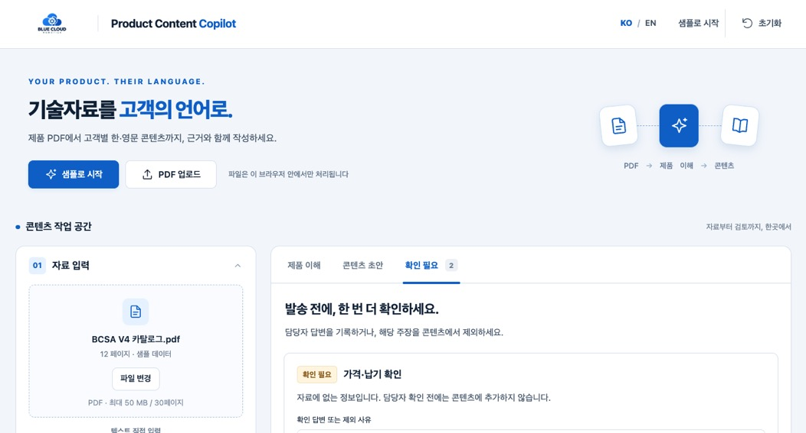
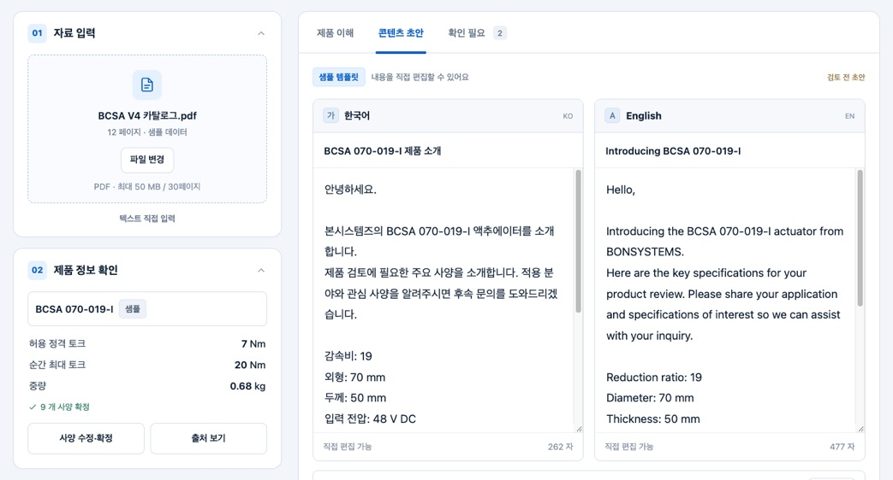
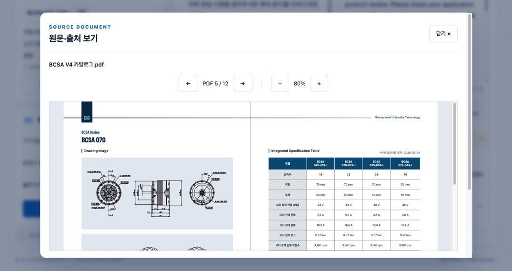

# Product Content Copilot

본시스템즈 BCSA 기술자료를 확인하고 고객별 한·영문 콘텐츠를 작성·검토하는 정적 웹 앱입니다. 첨부 명세서와 데스크톱·모바일 와이어프레임을 바탕으로 구현했습니다.

## 2026-09-16 작업 요약 및 오류 수정

- PDF 기술자료 업로드·원문 확인, 사양 확정, 고객별 한·영문 초안 작성, 검토, TXT 내보내기를 지원하는 MVP를 구현했습니다.
- 잘못된 JSON·오래된 AI 결과·알 수 없는 출처를 거절하고 기존 초안을 보존합니다. 사양이나 본문 변경 시 재검토가 필요하도록 처리하고, 클립보드 권한 거절 시 수동 복사를 제공합니다.
- 로컬 프로젝트 폴더 이름을 `c31`에서 `goorm-260916-mvp`로 변경했습니다.
- **앱 접속 문제 해결:** 폴더 변경 후 기존 Vite 프로세스가 이전 `c31` 경로를 사용하고 있음을 확인했습니다. 해당 프로세스를 종료하고 변경된 폴더에서 `npm run dev -- --port 5173 --strictPort`로 재시작했습니다.
- 재시작한 `http://127.0.0.1:5173/`의 HTTP 200 응답을 확인하고 브라우저에서 열었습니다. 사용자도 정상 작동을 확인했습니다.

저장소: [junsang-dong/goorm-260916-mvp](https://github.com/junsang-dong/goorm-260916-mvp)

## 실행

Node.js 24 권장. 처음 내려받는 경우:

```sh
git clone https://github.com/junsang-dong/goorm-260916-mvp.git
cd goorm-260916-mvp
```

프로젝트 폴더에서:

```sh
npm ci
npm run dev
```

표시되는 HTTP 주소를 브라우저에서 엽니다. 기본 주소는 http://127.0.0.1:5173 입니다.

```sh
npm test
npm run build
npm run preview
```

`dist/`는 정적 배포 산출물입니다. 이번 작업에서는 외부 배포를 수행하지 않았습니다. `file://`로 index.html을 직접 열지 마세요. 개발 서버를 종료했다면 `npm run dev`로 다시 실행하세요.

### 폴더 이동·이름 변경 후 앱이 열리지 않을 때

1. 기존 개발 서버를 실행한 터미널에서 `Ctrl+C`로 종료합니다.
2. 변경된 `goorm-260916-mvp` 폴더로 이동합니다.
3. 아래 명령으로 서버를 실행하고, 터미널을 켜 둔 상태로 브라우저에 접속합니다.

```sh
npm run dev -- --port 5173 --strictPort
```

접속 주소는 `http://127.0.0.1:5173/`입니다. 포트 사용 중 오류가 나면 해당 포트를 사용하는 기존 개발 서버를 확인하고 종료한 뒤 다시 실행하세요. `--strictPort`는 다른 포트로 자동 변경되는 것을 방지합니다. 임시 저장 작업은 같은 브라우저와 같은 주소에서 열어야 복구할 수 있습니다.

## 사용 흐름

1. **샘플로 시작**: 검토된 BCSA 070-019-I 데이터와 한·영문 템플릿을 불러옵니다. 고객 3종 × 형식 3종의 9개 조합을 지원합니다.
2. **실제 PDF**: 파일 선택 또는 드롭으로 PDF를 읽습니다. 최대 50 MiB, 30페이지이며 페이지별 텍스트를 실제로 추출합니다. 다른 PDF에는 샘플 사양을 연결하지 않습니다.
3. **사양 수정·확정**: 모델명, 항목명, 값, 단위, PDF 페이지, 발췌를 입력하고 원문 대조 후 확정합니다. PDF가 없으면 사용자 제공 텍스트로 기록합니다.
4. **작성 설정**: 고객, 형식, 출력 언어를 선택합니다. UI의 KO/EN 전환은 작성한 콘텐츠를 번역하거나 변경하지 않습니다.
5. **수동 AI**: ‘실제 자료로 작업하기’에서 포함할 페이지를 선택하고 요청문을 확인·복사합니다. 사용자가 외부 AI에서 실행한 뒤 JSON 또는 언어별 텍스트를 가져옵니다. 앱은 파일이나 요청문을 외부 AI에 자동 전송하지 않습니다.
6. **검토**: 초안을 직접 편집하고, 상대 언어 번역을 확인하며, 확인 질문에 답하거나 주장을 제외합니다. 모델·수치·단위·조건 대조 체크 후 검토 완료를 표시합니다.
7. **활용**: 언어를 선택하여 복사 또는 UTF-8 TXT 다운로드합니다. 출처와 질문, 샘플/수동 모드, 검토 상태도 내보냅니다.

## 구현 사항

- Vanilla JavaScript ES Modules, CSS, Vite 8.3.0, PDF.js 6.3.289. PDF worker는 라이브러리와 동일 버전이며 폰트·CMap·WASM도 로컬 자산입니다.
- 실제 카탈로그 원문 렌더링, PDF 페이지 이동·확대·축소, 원문 발췌, 읽기 취소·재시도, 파일 교체 시 비동기 작업 무효화.
- JSON의 구문·크기·배열 한도·modelId·requestId·inputRevision·출처 ID 검증. 잘못된 결과는 현재 정상 초안을 변경하지 않습니다. 알 수 없는 출처는 수정을 요구하며 전체 가져오기를 거부하는 보수적인 처리입니다.
- 입력 변경 시 초안 revision 불일치 표시, 한 언어 편집 시 상대 언어 번역 확인 요구, 사용자 검토 승인 취소.
- Clipboard API 거절 시 선택 가능한 수동 복사 창 제공.
- 기본 OFF인 IndexedDB 임시 저장. PDF와 전체 추출 텍스트는 저장하지 않습니다. 실제 업로드한 PDF는 SHA-256·파일 메타로 식별하고, 복구 시 해시가 같은 파일만 출처에 재연결합니다.
- 네이티브 dialog의 포커스 제한·Escape, 출처 창을 닫은 뒤 포커스 복귀, 키보드 결과 탭 이동, 숨긴 모바일 언어 편집기의 포커스 제외.
- 원본 자산은 수정하지 않았으며 작업용 로고·카탈로그를 public에 복사했습니다.

## 검증 결과

2026-09-16, macOS의 설치된 Google Chrome으로 검증했습니다.

- `npm test`: 핵심 로직 6개 테스트 통과. 9개 한영 샘플 조합, 수정 수치 반영, revision/번역 검토 무효화, JSON 오류·오래된 요청·모델/출처 불일치, 요청문 길이/페이지 선택, 저장 스냅샷과 내보내기 상태를 검사합니다.
- `npm run build`: 정적 빌드 성공.
- `node tests/browser-check.mjs`: 실제 Chrome 자동화. 샘플→편집→번역 확인→실제 PDF 5페이지→질문 처리→검토 완료→다운로드, UI 언어 전환 시 본문 보존, 임시 저장/복구, 실제 34 MiB 카탈로그 12페이지 업로드, 샘플 사양 미연결, 수동 사양 확정과 요청문을 검사합니다.
- 브라우저 크기 1440, 1024, 390, 360px에서 본문 가로 넘침 없음. 작은 화면은 **데스크톱 Chrome의 viewport 에뮬레이션**입니다.
- 브라우저 검증 추가 항목: JSON 결과 적용·알 수 없는 출처 거절 후 기존 초안 보존, 클립보드 권한 거절 대안, 복구 원문과 다른 파일 차단.
- 화면 캡처: `docs/references/app-desktop.png`, `docs/references/app-mobile.png`.

브라우저 검사 스크립트는 macOS의 `/Applications/Google Chrome.app/Contents/MacOS/Google Chrome`을 사용합니다. 다른 환경에서는 스크립트의 executablePath를 해당 Chrome 경로로 바꾸거나 Playwright Chromium을 설치하고 executablePath 옵션을 제거하세요. 개발 서버가 먼저 실행되어 있어야 합니다.

## 남은 한계 및 미검증 항목

- 실시간 AI API, 자동 번역, OCR, 사양 표 자동 해석, 계정·서버·공유·발송은 구현 범위가 아닙니다.
- 실제 PDF의 모델명·사양은 사용자가 확정해야 합니다. 샘플은 실시간 AI 분석 결과가 아닙니다.
- 사용자 수정 발췌·임의 항목명을 자동 번역하지 않습니다. 샘플 템플릿의 지원 필드 값과 단위를 주입합니다.
- 요청문은 가장 최근 1개만 지원합니다. 요청문 생성 뒤 조건을 변경하거나 작업을 복구하면 새 요청문을 만들어야 JSON 결과를 가져올 수 있습니다. 오래된 요청 결과를 자동 추정하지 않습니다.
- PDF에서 추출한 텍스트의 표 행·열 정확성을 보장하지 않습니다. 발췌 위치를 임의로 강조하지 않습니다.
- Safari, Firefox, 실제 iOS/Android 기기는 미검증입니다. 암호화·스캔 전용·30페이지 초과 PDF와 저장 용량 부족은 처리 경로가 있지만 각 종류의 실제 파일/환경으로는 미검증입니다.
- 자동화된 의미·수치 진위 판정은 제공하지 않습니다. 검토 완료는 사용자의 원문 대조 승인입니다.
- 브라우저 작업 저장은 같은 기기·같은 출처(origin)에 한하며 영구 보관이나 동기화를 보장하지 않습니다.

## 파일 구성

- `src/main.js`: 화면·이벤트·모달·사용자 작업 연결
- `src/state.js`: 입력 revision, 편집/검토 규칙
- `src/data/sample.js`: 샘플 제품·사실·출처·질문
- `src/services/`: PDF, 템플릿, 요청문, 결과 검증, 임시 저장, 내보내기
- `src/styles/`: 디자인 토큰과 반응형 스타일
- `public/assets/`, `public/samples/`, `public/pdfjs/`: 원본 작업용 자산과 PDF 런타임 자산
- `docs/references/`: 명세서·와이어프레임·검증 화면
- `tests/`: 핵심 로직·브라우저 흐름 검사
